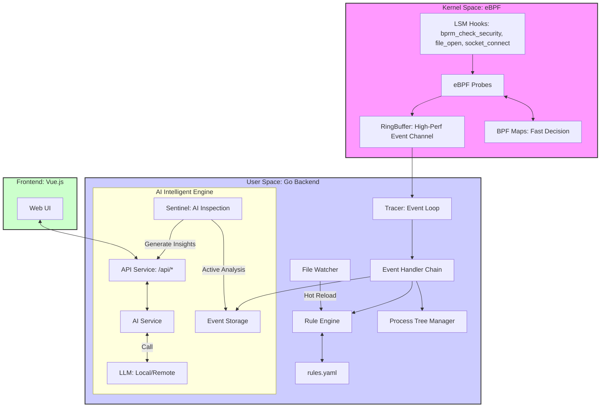

# Aegis Intelligent Security Observability Platform - Design Document

**Project Name**: Aegis Intelligent Security Observability Platform

**Track**: 2025 Operating System Design Competition - OS Application Development (System Tools Track)

---

## 1. Project Background & Objectives

### 1.1 Challenges with Current Security Tools

Current security monitoring tools in Linux environments face two main challenges:

* **Conflict between Massive Data and Analysis Efficiency**: Traditional tools (like Auditd) can collect comprehensive system call data, but this incurs significant performance overhead and generates massive amounts of raw logs. It is difficult for security analysts to efficiently extract useful information from this "data noise."
* **Alert Fatigue and Lack of Root Cause Analysis**: Existing tools excel at detecting and reporting violations (e.g., "File access denied"), but they often fail to provide the business logic or potential attack intent behind these behaviors. This leads to "alert fatigue" for operations teams, making it hard to distinguish real threats from false positives.

### 1.2 Design Philosophy: From "Passive Monitoring" to "Intelligent Analysis"

Aegis aims to solve the above challenges. It is not simply adding an AI chat interface to traditional tools, but rather embedding AI as the core analysis engine from the ground up.

The core philosophy of Aegis is **"Precision Observability"** rather than "Full Collection." Through practice, we found that monitoring key behaviors in just three dimensions—**Exec (Process Execution)**, **Connect (Network Connection)**, and **File (File Access)**—is sufficient to acquire the telemetry data needed to reconstruct attack chains with **low performance overhead**. This critical data is then fed into the AI engine for context correlation and deep analysis.

---

## 2. System Architecture

### 2.1 Overall Architecture Diagram



### 2.2 Data Processing Flow

1. **Kernel Space: Efficient Data Collection**

   * When key behaviors such as program execution, file access, or network connections occur, the kernel's **LSM (Linux Security Modules) hooks** are triggered, activating the corresponding **eBPF probes**.

   * The probe first queries **BPF Maps**. If an explicit blocking rule is hit (e.g., prohibiting access to a specific file), the operation is immediately terminated, and an event marked as "Blocked" is sent to user space.

   * If no blocking rule is hit, the probe simply pushes lightweight event metadata into the **RingBuffer**, a high-efficiency ring buffer used for communication between the kernel and user space.


2. **User Space: Event Processing & Analysis**

   * The backend service, written in Go, continuously reads events from the RingBuffer.

   * Each event undergoes a series of processing steps:
     * **Build Process Tree**: Using `exec` events, the parent-child relationships between processes are built and updated in memory in real-time, providing a complete call chain context for every event.
     * **Match Rules**: Events are matched against rules defined in `rules.yaml` to detect suspicious behavior.
     * **Store Events**: All events are archived to support subsequent AI analysis and manual backtracking.


3. **AI Engine: Intelligent Analysis & Insights**

   * **Human-Machine Collaborative Analysis**: Users can initiate an "Intelligent Analysis" request for any event via the Web interface. The AI service aggregates context related to that event (such as process chains, historical behavior, etc.), queries the Large Language Model (LLM), and returns easy-to-understand analysis results.

   * **Autonomous Inspection**: The background `Sentinel` task periodically analyzes recent events to attempt to discover potential anomaly patterns and generate insights such as "Rule Recommendations."


4. **Feedback Loop: Rule Hot Reloading**

   * When a user adopts an AI suggestion or manually modifies the `rules.yaml` file, the file monitoring service detects the change.

   * The rule engine automatically hot-reloads the new rules and updates rules requiring fast blocking into the kernel's BPF Maps. This process forms an "Observe-Analyze-Decide-Execute" closed loop, allowing the system to dynamically adapt to new security policies.


---

## 3. Module Design Description

### 3.1 Kernel Probes (`bpf/main.bpf.c`)

This module is the core of Aegis's data collection. Implemented entirely based on eBPF, it is responsible for high-performance event observation and rapid decision-making within the kernel.

* **Hooks**: Uses only three stable **LSM (Linux Security Modules)** hooks to achieve coverage and blocking capabilities for key security events with minimal performance impact.
  * `lsm/bprm_check_security`: Monitors process execution (`exec`).
  * `lsm/file_open`: Monitors file opening (`open`).
  * `lsm/socket_connect`: Monitors network connections (`connect`).


* **Fast-Path Decision**: Utilizes BPF Maps to implement efficient preliminary decisions within the kernel. This is key to Aegis's high performance.

  * For explicit, high-risk operations (e.g., "Deny access to `/etc/passwd`"), rules can be pushed directly to the BPF Map. The eBPF probe queries this Map inside the kernel; if matched, it blocks the operation immediately without waiting for user-space analysis, achieving microsecond-level response.
  * For other behaviors, only metadata is recorded and passed to user space for more complex analysis.


* **Communication Mechanism**: Uses `RingBuffer` as the bridge between kernel space and user space. This is a high-performance, lock-free ring buffer ensuring event data is passed efficiently and systematically from the kernel to the user-space program.

### 3.2 Core Bootstrap (`pkg/core/bootstrap.go`)

This module is responsible for initializing the backend service, loading and assembling all core components in the correct dependency order to ensure stable system startup.

* **Primary Responsibilities**:

  1. Initialize basic user-space services, such as the Process Tree Manager, Event Storage, etc.

  2. Load eBPF programs and attach them to the specified LSM hooks.
  3. Load the rule file from `rules.yaml`. This process is designed with fault tolerance; even if the rule file does not exist or is formatted incorrectly, the system will continue to run (using an empty rule set), ensuring service robustness.
  4. Populate parts of the rules requiring "Fast Path" processing (such as file block paths, ports) into the kernel's BPF Maps.


* **Rule Hot Reload**: This module also provides a `ReloadRules` method, allowing security rules to be dynamically updated and synced to the kernel without restarting the service.

### 3.3 Event Tracing & Dispatch (`pkg/tracer/`)

This module is responsible for consuming the event stream from the kernel RingBuffer and dispatching it to subsequent processing flows.

* **Event Loop (`EventLoop`)**: This is the starting point for user-space event processing. It continuously reads raw event data from the RingBuffer.

  * **Event Dispatch (`DispatchEvent`)**: Upon receiving an event, this function is responsible for:
    1. **Decoding**: Deserializing raw byte streams from the kernel into concrete event structures defined in Go.

  1. **State Update**: Synchronizing event information to various state managers, such as updating the process tree or recording events to storage, providing a data foundation for subsequent context analysis.

  1. **Dispatching**: Passing the decoded event object to the event handler chain for the next steps of analysis.


### 3.4 Event Handler Chain (`pkg/events/` & `pkg/server/bridge.go`)

This is an implementation of the Observer Pattern, responsible for broadcasting events to all registered handlers. `Bridge` is the core handler connecting the underlying tracer and the upper-layer analysis engine.

* **Primary Responsibilities**:

  1. **Real-time Push**: Pushing raw events to the frontend via WebSocket, enabling real-time event stream display in the UI.

  1. **Rule Matching**: Calling the Rule Engine to match events against loaded rules.

  1. **Alert Generation**: If an event hits an alert or blocking rule, `Bridge` generates structured alert information. It also has an important supplementary mechanism: even if no user-space rule is matched, if the event was directly blocked in the kernel, `Bridge` will still generate a critical "Kernel Block" alert, ensuring all blocking actions are visible on the interface.


### 3.5 Rule Engine (`pkg/rules/`)

Responsible for managing, loading, validating, and matching all security rules.

* **Rule Lifecycle Management**:
  * **Loading & Validation**: Loads rules from `rules.yaml` and performs strict syntax and logical validation.
  * **Atomic Saving**: Uses a "write to temp file, then rename" atomic operation when saving rules to prevent configuration file corruption due to unexpected interruptions (like program crashes).
  * **Smart Merge**: Provides the ability to merge new and old rules while automatically de-duplicating, which is the foundation for implementing the AI suggested rules function.


* **Matching Engine**: Upon loading rules, the engine performs preprocessing (e.g., pre-compiling regular expressions) to improve runtime matching efficiency. It only uses rules in the "Active" state for matching, ignoring rules in "Draft" or other states.

### 3.6 AI Intelligent Service (`pkg/ai/`)

The core analysis component of Aegis, encapsulating all logic for interaction with Large Language Models (LLM).

* **Pluggable Models**: The service can be configured at startup to use local models (via Ollama) or remote models (via APIs like OpenAI), providing users with flexibility and data privacy options.
* **Core Functions**:
  * **Context Snapshot**: Before AI analysis, the service builds a "Context Snapshot," aggregating full-dimensional information related to the event, including process call chains, historical behavior baselines, and associated events within a time window.
  * **Prompt Generation**: Calls different templates based on analysis scenarios (e.g., global diagnosis, multi-turn dialogue) to generate high-quality Prompts, ensuring questions to the LLM are precise and comprehensive.
  * **Interactive Analysis**: Supports users in exploring system behavior deeply through multi-turn dialogue and supports streaming responses, feeding the AI's analysis process back to the frontend in real-time to enhance user experience.


* **Autonomous Inspection (`Sentinel`)**: A background task-based autonomous analysis framework that periodically executes multiple independent analysis tasks and encapsulates findings into structured `Insight` objects pushed to the frontend.

  * **"Rule Promotion" Suggestions**: `Sentinel` monitors rules in the `testing` state. When a test rule is frequently hit, it generates a "Promotion Suggested" insight, which the user can review and decide whether to adopt as a formal rule. This is a safe, controllable human-machine collaborative rule evolution mode.
  * **Other Analysis Tasks**: `Sentinel` also performs anomaly detection, configuration optimization suggestions, and generates security daily reports.


---

### 4. Project Features

### 4.1 Feature 1: From "Event Alert" to "Root Cause Analysis"

Traditional tools usually only report "what happened," while Aegis attempts to explain "why it happened" and "whether it is normal."

When a suspicious event occurs, Aegis does not just throw an isolated alert but can provide a "Security Narrative" containing the attack chain and context via AI analysis. This is achieved by aggregating process call chains, historical behavior baselines, and associated events, and feeding them into the Large Language Model. This approach liberates security operations from the tedious work of processing massive isolated alerts, shifting focus to reading a small number of insightful security analyses, thus improving threat response efficiency.

### 4.2 Feature 2: From "Static Rules" to "Dynamic Evolution"

Static, pre-defined rule libraries struggle to keep up with the evolution of attack methods. Aegis provides the system with a degree of self-learning and evolutionary capability through the `Sentinel` mechanism.

Users can create rules in a `testing` state; these rules only record but do not alert when hit. `Sentinel` monitors the hit status of these rules in the background. When certain conditions are met, the system generates a "Rule Promotion Suggestion" insight, which is reviewed by a human to decide whether to adopt it as a formal rule. This human-machine collaborative mode establishes a data-driven, adaptive defense system that improves over time.

### 4.3 Feature 3: From "Full Collection" to "Precision Observability"

The philosophy of "collecting more is safer" often makes traditional tools themselves a system performance bottleneck. Aegis's design philosophy is: let the kernel do what it does best (simple, repetitive, efficient decision-making), and let user space and AI do what they do best (complex, context-heavy deep analysis).

* **Fast-Path Decision**: For clear threats, rules are pushed to the Kernel BPF Map. eBPF probes complete blocking directly in kernel space with zero user-space switching overhead.
* **Slow-Path Analysis**: For behaviors requiring complex judgment, eBPF probes only collect core metadata, handing it over to the user-space service and AI engine (which possess full context) for deep analysis.

This "Fast/Slow Separation" hybrid decision architecture allows Aegis to provide intelligent analysis capabilities while maintaining low performance overhead, making it suitable for 24/7 operation in production environments.

---

## 5. Technical Stack Selection

| **Technical Area**            | **Selection**              | **Alternatives**    | **Reason for Selection**                                     |
| ----------------------------- | -------------------------- | ------------------- | ------------------------------------------------------------ |
| **Kernel Probes**             | **eBPF (LSM Hooks)**       | Kprobes, Netfilter  | **LSM provides stable and blockable hooks**, which is key to implementing active defense. Compared to Kprobes, LSM interfaces are more stable; compared to Netfilter, eBPF provides a unified programming model. |
| **Kernel-User Communication** | **eBPF RingBuffer**        | PerfBuffer, BPF Map | **RingBuffer provides a high-performance, lock-free multi-producer/multi-consumer model**, perfectly suited for event stream scenarios, with overhead and complexity superior to other solutions. |
| **Backend Language**          | **Go**                     | Rust, C++           | **Go achieves a good balance between concurrent programming, performance, and development efficiency**. Its Goroutine mechanism is very suitable for developing high-concurrency data processing pipelines, and it has extensive ecosystem support in the cloud-native field. |
| **AI Integration**            | **Local/Remote Dual Mode** | Cloud API Only      | **Provides flexibility and data privacy options**. Users can run models locally (via Ollama) to ensure data does not leave the network or choose more powerful cloud APIs. |

---

## 6. Development Iteration Process

The development process of this project followed the "establish critical links first, then gradually improve capabilities" approach. The following describes what was done in each step, why, and how it relates to the final structure, divided by functional evolution to facilitate quick review and understanding of the implementation path.

### 6.1 Phase 1: Establish Minimum Viable Link (Kernel Collection → User Reception)

**Goal**: Validate the feasibility of eBPF + LSM hooks, open the event channel from kernel to user space, and see stable, parsable events in user space.

* Selected the three most critical behaviors as collection entry points: Process Execution (Exec), File Access (File), Network Connection (Connect).
* Implemented eBPF probes and basic data structures on the kernel side, using RingBuffer to send events to user space.
* Implemented the event read loop (`pkg/tracer/`) in user space, completing decoding and basic output, providing a unified event format for subsequent analysis modules.

At the end of this phase, the system possessed the minimal closed loop of "Can Collect, Can Transmit, Can Parse."

### 6.2 Phase 2: Introduce Rules & Alerts (From "Recording Events" to "Identifying Risks")

**Goal**: Enable the system not only to see events but also to identify risks based on rules and output alerts in a structured way.

* Introduced YAML-based rule file `rules.yaml` and implemented basic capabilities like loading, validation, and saving (`pkg/rules/`).
* Added rule matching logic in user space to compare events against rules and generate alert objects.
* Unified "Event Streams" and "Alerts" to upper layers (Frontend/Interface) via `Bridge` (`pkg/server/bridge.go`), avoiding multiple entry points during future expansion.

This phase transformed the project from an "Observability Tool" into a "System with Detection Capabilities."

### 6.3 Phase 3: Perfecting Context (Process Tree & Event Storage)

**Goal**: Provide context for subsequent explanation and correlation analysis, so alerts are no longer isolated "single events."

* Maintained Process Tree (`ProcessTree`) in real-time, saving parent-child relationships and call chains generated by exec.
* Added Event Storage (primarily memory-based) to archive recent events, supporting backtracking, correlation analysis, and UI display.
* Performed "State Update" before "Rule Matching" in the event dispatch stage, ensuring rule matching and AI analysis operate on the same consistent context.

The output of this phase: The system can answer "Who triggered this event, and what happened before?"

### 6.4 Phase 4: Add Active Defense (Fast-Path Blocking + Hot Reload)

**Goal**: Provide immediate blocking for clear high-risk behaviors and update policies without restarting.

* Pushed some rules to kernel-side BPF Maps to form "Fast-Path Decisions," returning `-EPERM` directly at LSM hooks to implement blocking.
* Retained "Slow-Path Rules" and more complex logic in user space to avoid stuffing complex policies into the kernel.
* Added rule hot reload mechanism: monitoring changes in `rules.yaml` and refreshing the rule engine while synchronously updating BPF Maps.

After this phase, the system possessed basic "Detect + Block" capabilities and could iterate quickly via configuration.

### 6.5 Phase 5: Servitization & Visualization (Web UI + API)

**Goal**: Lower the barrier to entry, enabling real-time presentation of observation, alerts, and analysis results in an interface.

* Exposed capabilities via API (`pkg/server/`), providing a unified entry point for the frontend.
* Introduced Web UI (Vue.js) to implement core interfaces like event streams and alert lists, facilitating intuitive viewing of system behavior for reviewers and users.

This phase transformed the project from a "Developer Tool" into a "Platform Form Factor" ready for direct use.

### 6.6 Phase 6: AI Analysis & Inspection (Explanation, Dialogue, Rule Suggestions)

**Goal**: Introduce AI for explanation and suggestions based on existing data and context, enabling users to understand risks faster and iterate rules.

* Encapsulated AI Service (`pkg/ai/`), providing event explanation, global diagnosis, and multi-turn dialogue functions; supporting Local/Remote model switching.
* Introduced `Sentinel` background inspection tasks: periodically analyzing recent data to find anomalies and output suggestions; gathering statistics on `testing` rules to give "Promote to Formal Rule" suggestions.

The focus of this phase: AI does not directly replace rules but performs auxiliary analysis given "context is ready," reducing the risk of false positives.

---

## 7. Competitor Comparison

In the Linux security domain, Aegis is positioned between traditional audit tools (like **Auditd**) and modern runtime security tools (like **Falco**), aiming to provide an AI-enhanced active defense solution.

| **Dimension**          | **Aegis (This Project)**                | **Falco (CNCF)**                  | **Auditd (Traditional)**     |
| ---------------------- | --------------------------------------- | --------------------------------- | ---------------------------- |
| **Core Positioning**   | **AI Intelligent Defense Platform**     | Cloud-Native Runtime Security     | System Compliance & Audit    |
| **Tech Base**          | **eBPF (LSM Hooks)**                    | eBPF / Kernel Module              | Linux Audit Subsystem        |
| **Defense Mode**       | **Active Blocking (Kernel Space)**      | Passive Detection (User Space)    | Passive Recording            |
| **Intelligence Level** | **AI Native (Built-in LLM)**            | Rule Driven (Needs External SIEM) | None                         |
| **Data Granularity**   | **Focused on 3 Probes (Exec/Net/File)** | Full System Calls                 | Full Audit Events            |
| **Ease of Use**        | **Low (Provides Web UI)**               | High (Mainly CLI/YAML)            | High (Complex config & logs) |

**Key Differences**:

1. **Defense Mode**: Falco's core is "Detection," while Aegis utilizes LSM Hooks to directly "Block" malicious behavior in kernel space, responding more timely.
2. **Intelligence Integration**: Falco relies on static rules, while Aegis has built-in logic for interacting with LLMs, capable of deeper root cause analysis of events and supporting rule evolution through human-machine collaboration.
3. **Data Strategy**: Auditd and Falco tend to collect more comprehensive data, which brings performance overhead and data noise. Aegis focuses on a few key events, enriching context via AI to achieve a balance between performance and analytical capability.

---

## 8. Build & Run

The project root directory contains a `Makefile` which encapsulates all compilation instructions.

### 8.1 Environmental Requirements

* **Operating System**: Linux Kernel 5.8+ (Recommend enabling `CONFIG_DEBUG_INFO_BTF=y` to support CO-RE).
* **Compiler**: Go 1.24+, Clang/LLVM 10.0+.
* **Frontend Environment**: Node.js 18+.
* **Toolchain**: `bpftool`.

### 8.2 Build Instructions

1. **Compile eBPF Programs**:

   ```bash
   make bpf
   ```


2. **Build Frontend Resources**:

   ```bash
   make frontend
   ```


3. **Build Complete Application** (Automatically executes the above steps and packages):

   ```bash
   make
   ```

The final executable is located at `build/aegis-web`.

---

## 9. Future Planning

Future plans involve exploration in the following directions:


* **Expand Probe Dimensions**:
  * **Cloud-Native Awareness**: Deep integration with Kubernetes to associate events with Cloud-Native objects like Pods and Namespaces.
  * **Kernel Module Monitoring**: Add monitoring for kernel module loading/unloading to detect advanced threats like Rootkits.
* **Enhance AI Capabilities**:

  * **Predictive Analysis**: Utilize time-series models to learn from historical data and attempt to predict potential future anomalous behaviors.
  * **Automated Response Orchestration**: When serious threats are detected, AI assists in generating response actions (e.g., calling Kubernetes API to isolate a Pod), realizing a higher degree of automation.
* **Build Open Ecosystem**:

  * **Plugin Architecture**: Modularize probes and analysis engines, allowing the community to contribute new monitoring and analysis capabilities.
  * **Standardized Integration**: Support exporting data in open standard formats like OpenTelemetry to integrate into existing security ecosystems like SIEM and SOAR.