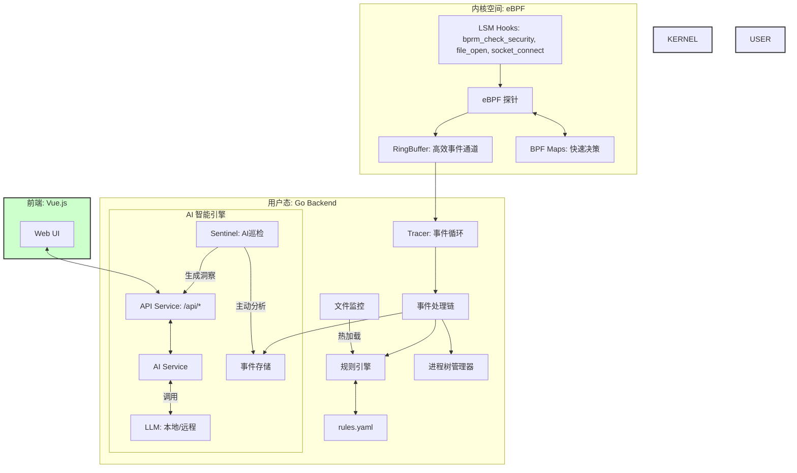

# Aegis 智能安全观测平台 - 设计文档

**项目名称**：Aegis 智能安全观测平台

**赛道**：2025年操作系统设计赛 - OS应用开发（系统工具方向）

---

## 1. 项目背景与目标

### 1.1 当前安全工具的挑战

当前 Linux 环境下的安全监控工具面临两个主要挑战：

*   **海量数据与分析效率的矛盾**：传统工具（如 Auditd）能够采集全面的系统调用数据，但这会产生巨大的性能开销和海量原始日志。安全分析人员难以从这些“数据噪音”中高效地提取有用信息。
*   **告警泛滥与根源分析的缺失**：现有工具擅长发现并报告违规行为（例如“文件访问被拒绝”），但通常不提供这些行为背后的业务逻辑或潜在攻击意图。这导致运维团队面对大量告警时容易产生“告警疲劳”，难以区分真正的威胁和误报。

### 1.2 Aegis 的设计思路：从“被动监控”到“智能分析”

Aegis 旨在解决上述挑战。它并非简单地为传统工具增加一个 AI 聊天界面，而是从底层设计上就将 AI 作为分析引擎的核心。

Aegis 的核心思路是 **“精准观测”**，而非“全量采集”。我们通过实践发现，仅需监控 **Exec (程序执行)**、**Connect (网络连接)** 和 **File (文件访问)** 这三个维度的关键行为，就足以在**较低性能损耗**下，获取构建攻击链路所需的遥测数据。这些关键数据随后被送入 AI 引擎，进行上下文关联和深度分析。

---

## 2. 系统架构

### 2.1 整体架构图



### 2.2 数据处理流程

1.  **内核态：高效的数据采集**
    *   当程序执行、文件访问或网络连接等关键行为发生时，内核的 **LSM (Linux Security Modules) 钩子**被触发，激活相应的 **eBPF 探针**。
    *   探针首先查询 **BPF Maps**。如果命中明确的阻断规则（例如，禁止访问某个文件），则立即终止该操作，并向用户态发送一个标记为“已阻断”的事件。
    *   如果未命中阻断规则，探针仅将轻量级的事件元数据推入 **RingBuffer**，这是一个高效的、用于内核与用户态通信的环形缓冲区。

2.  **用户态：事件处理与分析**
    *   Go 语言编写的后端服务从 RingBuffer 中持续读取事件。
    *   每个事件都会经过一系列处理：
        *   **构建进程树**：利用 `exec` 事件，在内存中实时构建和更新进程之间的父子关系，为每个事件提供完整的调用链上下文。
        *   **匹配规则**：将事件与 `rules.yaml` 中定义的规则进行匹配，以发现可疑行为。
        *   **存储事件**：所有事件都被归档，为后续的 AI 分析和人工回溯提供数据支持。

3.  **AI 引擎：智能分析与洞察**
    *   **人机协同分析**：用户可以通过 Web 界面对任何事件发起“智能分析”请求。AI 服务会聚合该事件相关的上下文信息（如进程链、历史行为等），向大语言模型 (LLM) 提问，并返回易于理解的分析结果。
    *   **自主巡检**：后台的 `Sentinel` 任务会定期对近期的事件进行自动分析，尝试发现潜在的异常模式，并生成“规则建议”等洞察。

4.  **反馈闭环：规则的热更新**
    *   当用户采纳 AI 的建议或手动修改 `rules.yaml` 规则文件时，文件监控服务会检测到变更。
    *   规则引擎将自动热加载新规则，并将需要快速阻断的规则更新到内核的 BPF Maps 中。这个过程形成了“观察-分析-决策-执行”的闭环，使系统能够动态适应新的安全策略。

---

## 3. 模块设计说明

### 3.1 内核态探针 (`bpf/main.bpf.c`)

此模块是 Aegis 的数据采集核心，完全基于 eBPF 实现，负责在内核中进行高性能的事件观测和快速决策。

*   **挂载点 (Hooks)**: 仅使用三个稳定的 **LSM (Linux Security Modules)** 挂载点，以最少的性能影响，实现对关键安全事件的覆盖和阻断能力。
    *   `lsm/bprm_check_security`: 监控进程执行 (`exec`)。
    *   `lsm/file_open`: 监控文件打开 (`open`)。
    *   `lsm/socket_connect`: 监控网络连接 (`connect`)。

*   **快路径决策 (Fast-Path Decision)**: 利用 BPF Maps 在内核中实现高效的初步决策，这是 Aegis 高性能的关键。
    *   对于明确的、高风险的操作（如“禁止访问 `/etc/passwd`”），规则可以直接下发到 BPF Map 中。eBPF 探针在内核中直接查询此 Map，如果命中，则立即阻断操作，无需等待用户态的分析，实现了微秒级的响应。
    *   对于其他行为，仅记录元数据，交由用户态进行更复杂的分析。

*   **通信机制 (Communication)**: 使用 `RingBuffer` 作为内核态与用户态之间的通信桥梁。这是一个高性能、无锁的环形缓冲区，确保了事件数据能够高效、有序地从内核传递到用户态程序。

### 3.2 核心引导程序 (`pkg/core/bootstrap.go`)

此模块负责后端服务的初始化，按照正确的依赖顺序加载并组装所有核心组件，确保系统稳定启动。

*   **主要职责**: 
    1.  初始化用户态的各项基础服务，如进程树管理器、事件存储等。
    2.  加载 eBPF 程序并将其挂载到指定的 LSM 钩子上。
    3.  从 `rules.yaml` 加载规则文件。此过程具有容错设计，即使规则文件不存在或格式错误，系统也会继续运行（使用空规则集），保证了服务的健壮性。
    4.  将规则中需要“快速路径”处理的部分（如文件阻断路径、端口）填充到内核的 BPF Maps 中。

*   **规则热加载**: 该模块也提供了 `ReloadRules` 方法，允许在不重启服务的情况下动态更新安全规则，并将其同步到内核。

### 3.3 事件追踪与分发 (`pkg/tracer/`)

此模块负责从内核的 RingBuffer 中消费事件流，并将其派发到后续的处理流程中。

*   **事件循环 (`EventLoop`)**: 这是用户态事件处理的起点。它持续地从 RingBuffer 中读取原始事件数据。
*   **事件分发 (`DispatchEvent`)**: 收到事件后，此函数负责：
    1.  **解码**: 将来自内核的原始字节流反序列化为 Go 语言中定义的具体事件结构体。
    2.  **状态更新**: 将事件信息同步到各个状态管理器中，例如更新进程树、记录事件到存储等，为后续的上下文分析提供数据基础。
    3.  **派发**: 将解码后的事件对象传递给事件处理链，进行下一步分析。

### 3.4 事件处理链 (`pkg/events/` & `pkg/server/bridge.go`)

这是一个观察者模式的实现，负责将事件广播给所有注册的处理器。`Bridge` 是其中的核心处理器，连接了底层的追踪器和上层的分析引擎。

*   **主要职责**: 
    1.  **实时推送**: 将原始事件通过 WebSocket 推送到前端，实现 UI 上的实时事件流展示。
    2.  **规则匹配**: 调用规则引擎，将事件与已加载的规则进行匹配。
    3.  **告警生成**: 如果事件命中了告警或阻断规则，`Bridge` 会生成结构化的告警信息。同时，它有一个重要的补充机制：即使没有匹配到任何用户态规则，但若事件在内核态被直接阻断，`Bridge` 依然会生成一个“内核阻断”的严重告警，确保所有阻断行为都在界面上可见。

### 3.5 规则引擎 (`pkg/rules/`)

负责管理、加载、校验和匹配所有安全规则。

*   **规则生命周期管理**: 
    *   **加载与校验**: 从 `rules.yaml` 加载规则，并对其进行严格的语法和逻辑校验。
    *   **原子化保存**: 保存规则时，采用“先写入临时文件，再重命名”的原子操作，防止因意外中断（如程序崩溃）导致配置文件损坏。
    *   **智能合并**: 提供合并新旧规则并自动去重的能力，这是实现 AI 建议规则功能的基础。

*   **匹配引擎**: 在加载规则时，引擎会进行预处理（例如，对正则表达式进行预编译），以提高运行时的匹配效率。它只使用处于“活跃”状态的规则进行匹配，忽略“草稿”等状态的规则。

### 3.6 AI 智能服务 (`pkg/ai/`)

Aegis 的分析核心，封装了与大语言模型 (LLM) 交互的所有逻辑。

*   **可插拔模型**: 服务在启动时可根据配置选择使用本地模型（通过 Ollama）或远程模型（通过 OpenAI 等 API），为用户提供了灵活性和数据隐私保护选项。

*   **核心功能**: 
    *   **上下文快照**: 在进行 AI 分析前，服务会构建一个“上下文快照”，聚合与事件相关的全维度信息，包括进程调用链、历史行为基线、时间窗口内的关联事件等。
    *   **Prompt 生成**: 根据不同的分析场景（如全局诊断、多轮对话），调用不同的模板来生成高质量的 Prompt，确保向 LLM 的提问既精准又全面。
    *   **交互式分析**: 支持用户通过多轮对话的方式对系统行为进行深入探查，并支持流式响应，将 AI 的分析过程实时反馈给前端，提升用户体验。

*   **自主巡检 (`Sentinel`)**: 这是一个基于后台任务的自主分析框架，周期性地执行多个独立的分析任务，并将发现封装成结构化的“洞察”(`Insight`)对象推送给前端。
    *   **“规则晋升”建议**: `Sentinel` 会监控处于 `testing` (测试中) 状态的规则。当某条测试规则被频繁命中后，它会生成一个“建议晋升”的洞察，由用户审核并决定是否采纳为正式规则。这是一种安全、可控的人机协同规则进化模式。
    *   **其他分析任务**: `Sentinel` 还会执行异常检测、配置优化建议、生成安全日报等任务。

---

## 4. 项目特点

### 4.1 特点一：从“事件告警”到“根源分析”

传统工具通常只报告“发生了什么”，而 Aegis 尝试解释“为什么会发生”以及“这是否正常”。

当一个可疑事件发生时，Aegis 不仅是抛出一个孤立的告警，而是可以通过 AI 分析，提供一个包含攻击链路和上下文的“安全叙事”。这是通过聚合进程调用链、历史行为基线和关联事件，并将其输入大语言模型实现的。这种方式将安全运维从处理海量孤立告警的繁重工作中解放出来，转变为阅读少量、富有洞察的安全分析，提升了威胁响应的效率。

### 4.2 特点二：从“静态规则”到“动态演进”

静态的、预定义的规则库难以跟上攻击手段的演变。Aegis 通过 `Sentinel` 机制，为系统提供了一定的自我学习和演进能力。

用户可以创建处于 `testing` 状态的规则，这类规则在命中时只记录不告警。`Sentinel` 会在后台监控这些规则的命中情况。当满足一定条件时，系统会生成一个“规则晋升建议”的洞察，由人工审核后决定是否采纳为正式规则。这种人机协同的模式，建立了一套由数据驱动的、能够逐步完善的自适应防御体系。

### 4.3 特点三：从“全量采集”到“精准观测”

“采集越多越安全”的理念，往往使传统工具自身成为系统性能瓶颈。Aegis 的设计思路是：让内核做它最擅长的事（简单、重复、高效的决策），让用户态和 AI 做它们最擅长的事（复杂、需要上下文的深度分析）。

*   **快路径决策**：对于明确的威胁，规则被下发至内核 BPF Map。eBPF 探针在内核空间直接完成阻断，无任何用户态切换开销。
*   **慢路径分析**：对于需要复杂判断的行为，eBPF 探针仅采集核心元数据，交由拥有完整上下文的用户态服务和 AI 引擎进行深度分析。

这种“快慢分离”的混合决策架构，使得 Aegis 在提供智能分析能力的同时，保持了较低的性能损耗，具备在生产环境中全天候运行的能力。

---

## 5. 技术选型

| **技术领域**        | **选择**             | **备选方案**        | **选择理由**                                                 |
| :------------------ | :------------------- | :------------------ | :----------------------------------------------------------- |
| **内核探针技术**    | **eBPF (LSM Hooks)** | Kprobes, Netfilter  | **LSM 提供了稳定且可阻断的挂载点**，是实现主动防御的关键。相比 Kprobes，LSM 接口更稳定；相比 Netfilter，eBPF 提供了统一的编程模型。 |
| **内核-用户态通信** | **eBPF RingBuffer**  | PerfBuffer, BPF Map | **RingBuffer 提供了高性能、无锁的多生产者多消费者模型**，非常适合事件流场景，开销和复杂度均优于其他方案。 |
| **后端语言**        | **Go**               | Rust, C++           | **Go 在并发编程、性能和开发效率之间取得了良好平衡**。其 Goroutine 机制非常适合开发高并发的数据处理管道，且在云原生领域有广泛的生态支持。 |
| **AI 模型集成**     | **本地/远程双模式**    | 仅云端 API          | **提供了灵活性和数据隐私选项**。用户可在本地（通过 Ollama）运行模型以保证数据不出网，也可选择功能更强大的云端 API。 |

---

## 6. 开发迭代过程

本项目的开发过程按“先打通关键链路，再逐步完善能力”的思路推进。

### 6.1 阶段一：建立最小可用链路（内核采集 → 用户态接收）

**目标**：先验证 eBPF + LSM 钩子的可行性，打通从内核到用户态的事件通道，并能在用户态看到稳定、可解析的事件。

* 选择最关键的三类行为作为采集入口：进程执行（Exec）、文件访问（File）、网络连接（Connect）。
* 在内核侧实现 eBPF 探针与基础数据结构，使用 RingBuffer 将事件送到用户态。
* 在用户态实现事件读取循环（`pkg/tracer/`），完成解码与基本输出，为后续分析模块提供统一的事件格式。

这一阶段结束后，系统已经具备“能采集、能传输、能解析”的最小闭环。

### 6.2 阶段二：引入规则与告警（从“记录事件”到“识别风险”）

**目标**：让系统不仅能看到事件，还能根据规则识别风险，并以结构化方式对外输出告警。

* 引入基于 YAML 的规则文件 `rules.yaml`，并实现加载、校验、保存等基础能力（`pkg/rules/`）。
* 在用户态增加规则匹配逻辑，将事件与规则进行比对，生成告警对象。
* 通过 `Bridge`（`pkg/server/bridge.go`）将“事件流”和“告警”统一对接到上层（前端/接口），避免后续功能扩展时出现多个入口。

这一阶段使项目从“观测工具”变成了“具备检测能力的系统”。

### 6.3 阶段三：完善上下文（进程树与事件存储）

**目标**：为后续的解释和关联分析提供上下文，让告警不再是孤立的“单条事件”。

* 实时维护进程树（`ProcessTree`），把 exec 产生的父子关系和调用链保存下来。
* 增加事件存储（内存为主），将近期事件归档，以支持回溯、关联分析和 UI 展示。
* 在事件分发阶段先做“状态更新”再做“规则匹配”，保证规则匹配与 AI 分析拿到的是同一份一致上下文。

这一阶段的产出是：系统能够回答“这个事件是谁触发的、之前发生过什么”。

### 6.4 阶段四：增加主动防御（快路径阻断 + 热更新）

**目标**：对明确高风险行为提供即时阻断，并且在不重启的情况下更新策略。

* 将部分规则下发到内核侧 BPF Maps，形成“快路径决策”，在 LSM 钩子处直接返回 `-EPERM` 实现阻断。
* 在用户态保留“慢路径规则”与更复杂的判断逻辑，避免把复杂策略硬塞进内核。
* 增加规则热加载机制：监控 `rules.yaml` 变化并刷新规则引擎，同时同步更新 BPF Maps。

这一阶段完成后，系统具备了“检测 + 阻断”的基础能力，并且可通过配置快速迭代。

#### 阶段五：服务化与可视化（Web UI + API）

**目标**：降低使用门槛，使观测、告警、分析结果可以在界面中实时呈现。

* 将能力以 API 的方式对外提供（`pkg/server/`），为前端提供统一入口。
* 引入 Web UI（Vue.js），实现事件流、告警列表等核心界面，方便评审与用户直观看到系统行为。

这一阶段使项目从“开发者工具”变成了“可直接使用的平台形态”。

#### 阶段六：AI 分析与巡检（解释、对话、规则建议）

**目标**：在已有数据与上下文基础上，引入 AI 做解释与建议，让使用者能更快理解风险并迭代规则。

* 封装 AI 服务（`pkg/ai/`），提供事件解释、全局诊断、多轮对话等功能；支持本地/远程模型切换。
* 引入 `Sentinel` 后台巡检任务：定期分析近期数据，发现异常、输出建议；对 `testing` 规则统计命中情况，给出“是否晋升为正式规则”的建议。

这一阶段的重点是：AI 不直接替代规则，而是在“上下文已准备好”的前提下做辅助分析，降低误判风险。

---

### 7. 竞品对比

在 Linux 安全领域，Aegis 的定位介于传统的审计工具（如 **Auditd**）和现代的运行时安全工具（如 **Falco**）之间，旨在提供一种 AI 增强的主动防御方案。

| **维度**     | **Aegis (本项目)**                  | **Falco (CNCF)**                     | **Auditd (传统工具)**       |
| ------------ | ----------------------------------- | ------------------------------------ | ------------------------- |
| **核心定位** | **AI 智能防御平台**                 | 云原生运行时安全监测                 | 系统合规与审计工具        |
| **技术底座** | **eBPF (LSM Hooks)**                | eBPF / 内核模块                      | Linux Audit 子系统        |
| **防御模式** | **主动阻断 (内核态)**               | 被动检测 (用户态)                    | 被动记录                  |
| **智能水平** | **AI 原生 (内置 LLM)**              | 规则驱动 (需外接 SIEM)               | 无                        |
| **数据粒度** | **三探针聚焦 (Exec/Net/File)**      | 全量系统调用                         | 全量审计事件              |
| **上手难度** | **较低 (提供 Web UI)**              | 较高 (主要为 CLI/YAML)               | 较高 (配置和日志复杂)     |

**主要差异点**: 

1.  **防御模式**: Falco 的核心是“检测”，而 Aegis 利用 LSM Hooks 能够在内核态直接“阻断”恶意行为，响应更及时。
2.  **智能集成**: Falco 依赖静态规则，而 Aegis 内置了与 LLM 的交互逻辑，能够对事件进行更深度的根源分析，并支持通过人机协同模式演进规则。
3.  **数据策略**: Auditd 和 Falco 倾向于采集更全面的数据，这带来了性能开销和数据噪音。Aegis 则聚焦于少数关键事件，通过 AI 进行上下文丰富，以求在性能和分析能力之间取得平衡。

---

## 8. 构建与运行

项目根目录包含 `Makefile`，封装了所有编译指令。

### 8.1 环境要求

*   **操作系统**: Linux Kernel 5.8+ (建议开启 `CONFIG_DEBUG_INFO_BTF=y` 以支持 CO-RE)。
*   **编译器**: Go 1.24+, Clang/LLVM 10.0+。
*   **前端环境**: Node.js 18+。
*   **工具链**: `bpftool`。

### 8.2 构建指令

1.  **编译 eBPF 程序**:
    ```bash
    make bpf
    ```

2.  **构建前端资源**:
    ```bash
    make frontend
    ```

3.  **构建完整应用** (自动执行以上步骤并打包):
    ```bash
    make
    ```
    最终生成的可执行文件位于 `build/aegis-web`。

---

## 9. 未来规划

Aegis 未来计划在以下方向进行探索：

*   **扩展探针维度**：
    *   **云原生感知**：深度集成 Kubernetes，将事件与 Pod、Namespace 等云原生对象关联。
    *   **内核模块监控**：增加对内核模块加载/卸载的监控，以检测 Rootkit 等高级威胁。

*   **增强 AI 能力**：
    *   **预测性分析**：利用时间序列模型，从历史数据中学习，尝试预测未来可能发生的异常行为。
    *   **自动化响应编排**：当检测到严重威胁时，由 AI 辅助生成响应动作（如调用 Kubernetes API 隔离 Pod），实现更高程度的自动化。

*   **构建开放生态**：
    *   **插件化架构**：将探针和分析引擎插件化，允许社区贡献新的监控和分析能力。
    *   **标准化集成**：支持以 OpenTelemetry 等开放标准格式导出数据，以便融入现有的 SIEM、SOAR 等安全生态。
